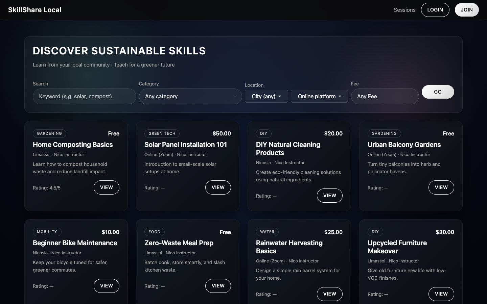
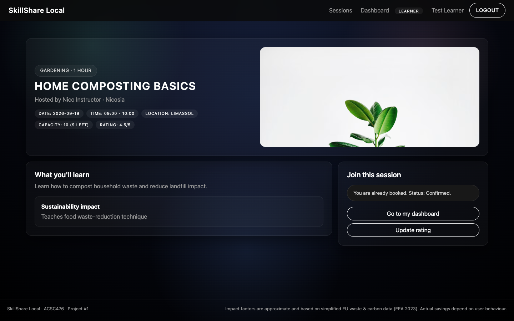

# SkillShare Local

PHP/MySQL coursework platform with learner/instructor/admin roles, sessions, bookings and ratings.

## Overview

PHP/MySQL skill-session platform with learner/instructor/admin roles, session creation, booking, ratings and suspension management.

## Features

Role authorization, prepared queries, relational schema, session CRUD, bookings, rating workflow.

## Tech Stack

PHP / MySQL

## Preview

Local preview using the published demonstration seed in a disposable MariaDB database. Demo session dates were moved forward only in that temporary database so the directory and session-detail views remain visible.

## Getting Started

Requires PHP with the `mysqli` extension and a local MariaDB 10.4+ database (the seed uses MariaDB-compatible conditional column additions). Create an empty `skillshare_local` database and import `sql/schema.sql`, then the explicitly labeled demonstration seed `sql/seed.sql`. Check `includes/config.php` for the local database name and root/empty-password development defaults; these are for an isolated local database only. From the repository root run `php -S 127.0.0.1:8000 -t .` and visit `http://127.0.0.1:8000/public/index.php`. Serving the project root makes the sibling `assets` directory accessible. The base URL defaults to `/public/`; for an XAMPP subdirectory, set the `SKILLSHARE_BASE_URL` environment variable to `/skillshare/public/` before starting PHP. This is academic local-development software, not a hardened deployment: session and CSRF protection still need review before exposure to other users. Diagnostic test endpoints have been removed. The seed contains deliberate demo accounts; original account database exports are excluded.

## Validation

Lightweight local checks: JavaScript syntax, PHP syntax. Compilation and syntax checks do not verify application behavior. Source is preserved; interactive application behavior was not executed during archival.

## Notes

Original implementation is preserved. Build outputs, dependencies, machine-specific IDE state, backups, submission documents and private runtime data are excluded. No license has been inferred for the original work.

Academic context: the original footer identifies ACSC476 Project #1.
